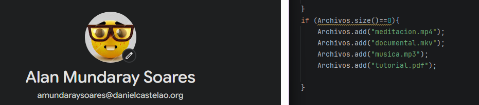

# Tarea 09

pequeña aclaracion: tuve un enfoque distinto en el gestor de archivos pero luego hice un cambio para mejorar mi codigo por recomendacion de un compañero [isaac] y aclara que no esta copiado y soy conciente de que hace mi codigo

## Clase Descarga:
Lo primero que tendremos que hacer es crear la clase y asignarle sus respectivos atributos:
- descarga
- aleatorio
- TiempoFinal

Luego crearemos un constructor e iniciaremos los atributos:
- a descargar será igual al string con el nombre de la descarga que reciba.
- en aleatorio será un nuevo objeto de tipo random.
- e iniciaremos el TiempoFinal a 0.


Ahora haremos el run, el seguimiento que va a hacer el proceso:

- Vamos a crear una variable de tiempo que se inicia en 0, junto a otra de porcentaje que también se inicia en 0.
- Ahora haremos un bucle el cual se ejecutará 10 veces y se encargará de hacer lo siguiente:
  - En una variable `num` va a almacenar aleatoriamente uno de estos dos dígitos (0 o 1) y, dependiendo de cuál toque, le asignará un tiempo en ms al proceso (0 = 100 ms o 1 = 500 ms).
  - Ahora vamos a ir guardando en la variable `TiempoFinal` la suma de cada tiempo que genere el bucle.
  - Luego haremos un `try` que lo que hará dentro es probar a hacer que el proceso duerma usando `Thread.sleep(tiempo)` y, en caso de un error, que ejecute el `catch`.
  - Por último, para ir calculando el porcentaje, lo que hay que hacer es que la variable `i` del bucle se vaya multiplicando por 100 y dividiendo por el máximo al cual puede llegar, que en este caso es 10 (también es más fácil si hubiera puesto simplemente `i * 10`).
    


- Y ya para acabar la clase, vamos a crear un getter para el `tiempoFinal`.
  


## GestorDescargas:

- Lo primero será crear un array de `String` el cual guardará el nombre de las descargas:
  


- Ahora tendremos que hacer un array de objetos de nuestra clase `Descarga`, el cual llamaremos `l_descargas` (lista descargas), la cual tendrá de tamaño el tamaño de la lista de archivos.
- Luego haremos un bucle, el cual es ir almacenando los nombres de las descargas en el array de `l_descargas`.
- Iniciaremos un `currentTimeMillis` que lo que hará es decirme el tiempo actual cuando se ejecute; por lo tanto, es el `tInicio` (tiempo inicio).
- Ya con todo lo anterior acabado, toca hacer los procesos, y para ello vamos a hacer un bucle que va a ir sacando los objetos descargas de dentro del array y los iniciará con el `start`.
  


- Ahora haremos el mismo bucle anterior pero para hacer lo contrario: junto con un `try`, haremos que el programa espere a que acaben con un `join` y, en caso de error, un `catch`.
- Marcaremos en una variable `tFin` el tiempo final de los procesos.
- Y haciendo una resta de tiempo final menos el tiempo inicial podremos sacar el tiempo real que han tardado los procesos.
- Tiempo secuencial: es el tiempo que tardarían los procesos si se ejecutaran uno a uno. Para ello llamaremos a todos los `get_TiempoFinal()` y los sumaremos.
  


## Preguntas
- Ejecutad el programa tres veces y completad la tabla con lo que os salga:

| Ejecución | Descarga más lenta | Tiempo real (ms) | Suma (ms) |
| :---: | :---: | :---: | :---: |
| 1 | 4200 ms | 4205 ms | 12000 ms |
| 2 | 3000 ms | 3008 ms | 8800 ms |
| 3 | 3400 ms | 3408 ms | 12000 ms |

Debajo de la tabla, responded a estas dos preguntas:
- **¿Por qué el tiempo real es mucho menor que la suma?**
  - Porque el tiempo real es el tiempo que tarda el proceso más lento mientras se lanzan todos a la vez. En cambio, la suma es como si los procesos se ejecutaran uno por uno, lo cual toma más tiempo.

- **¿Qué pasa si hacéis `start()` y `join()` dentro del mismo bucle? Probadlo y poned el tiempo real que os sale.**
  - Lo que pasa es que los procesos se irán ejecutando uno por uno.


- Comprobación (el usuario de mi ordenador es Seta, lo cual se puede ver en diferentes partes del código, por si quedan dudas de si es mío el resultado).
```plaintext
C:\Users\seta\.jdks\openjdk-27\bin\java.exe "-javaagent:C:\Program Files\JetBrains\IntelliJ IDEA 2026.2.3\lib\idea_rt.jar=49336" -Dfile.encoding=UTF-8 -Dsun.stdout.encoding=UTF-8 -Dsun.stderr.encoding=UTF-8 -classpath "C:\Users\seta\IdeaProjects\Gestor de Descargas\out\production\Gestor de Descargas" GestorDescargas
[Descarga-meditacion.mp4]10%
[Descarga-meditacion.mp4]20%
[Descarga-meditacion.mp4]30%
[Descarga-meditacion.mp4]40%
[Descarga-meditacion.mp4]50%
[Descarga-meditacion.mp4]60%
[Descarga-meditacion.mp4]70%
[Descarga-meditacion.mp4]80%
[Descarga-meditacion.mp4]90%
[Descarga-meditacion.mp4]100%
[meditacion.mp4]completada en 3400 ms
[Descarga-documental.mkv]10%
[Descarga-documental.mkv]20%
[Descarga-documental.mkv]30%
[Descarga-documental.mkv]40%
[Descarga-documental.mkv]50%
[Descarga-documental.mkv]60%
[Descarga-documental.mkv]70%
[Descarga-documental.mkv]80%
[Descarga-documental.mkv]90%
[Descarga-documental.mkv]100%
[documental.mkv]completada en 2600 ms
[Descarga-musica.mp3]10%
[Descarga-musica.mp3]20%
[Descarga-musica.mp3]30%
[Descarga-musica.mp3]40%
[Descarga-musica.mp3]50%
[Descarga-musica.mp3]60%
[Descarga-musica.mp3]70%
[Descarga-musica.mp3]80%
[Descarga-musica.mp3]90%
[Descarga-musica.mp3]100%
[musica.mp3]completada en 3000 ms
[Descarga-tutorial.pdf]10%
[Descarga-tutorial.pdf]20%
[Descarga-tutorial.pdf]30%
[Descarga-tutorial.pdf]40%
[Descarga-tutorial.pdf]50%
[Descarga-tutorial.pdf]60%
[Descarga-tutorial.pdf]70%
[Descarga-tutorial.pdf]80%
[Descarga-tutorial.pdf]90%
[Descarga-tutorial.pdf]100%
[tutorial.pdf]completada en 3800 ms
Todas las descargas han terminado.
Tiempo real: 12833 ms
Si se hubieran descargado una detrás de otra: 12800

Process finished with exit code 0
```
## Parte 2


